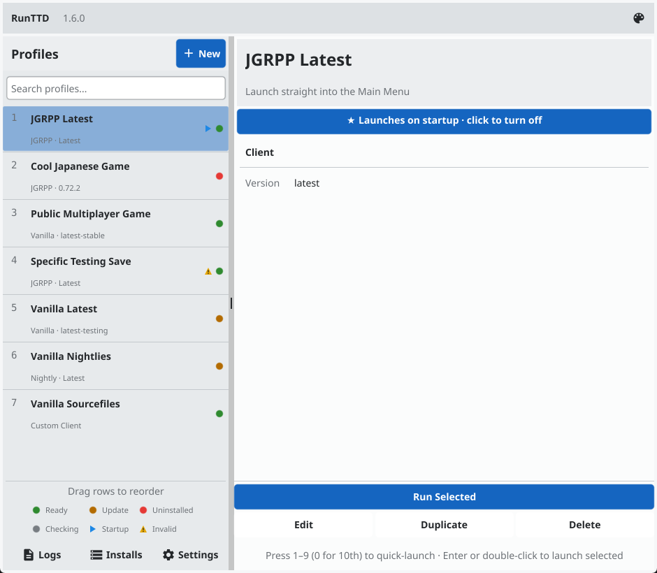
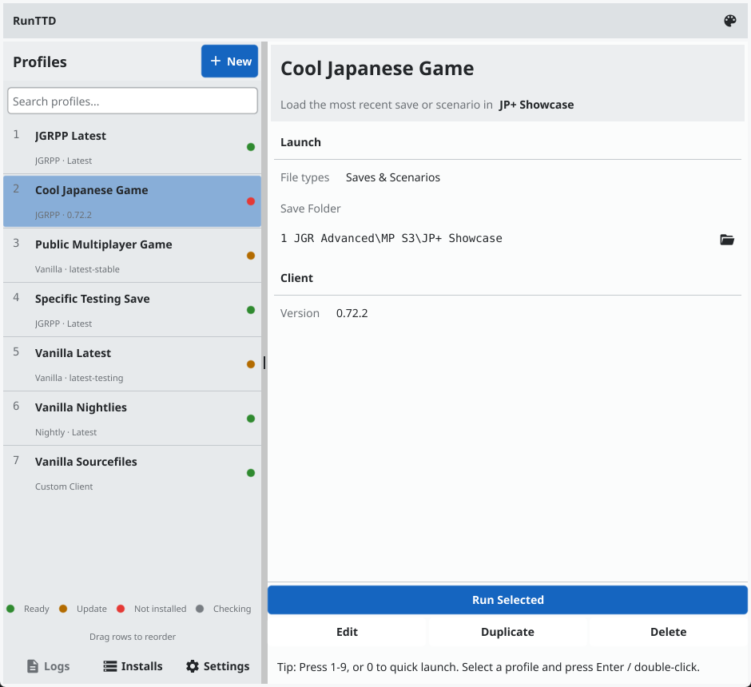
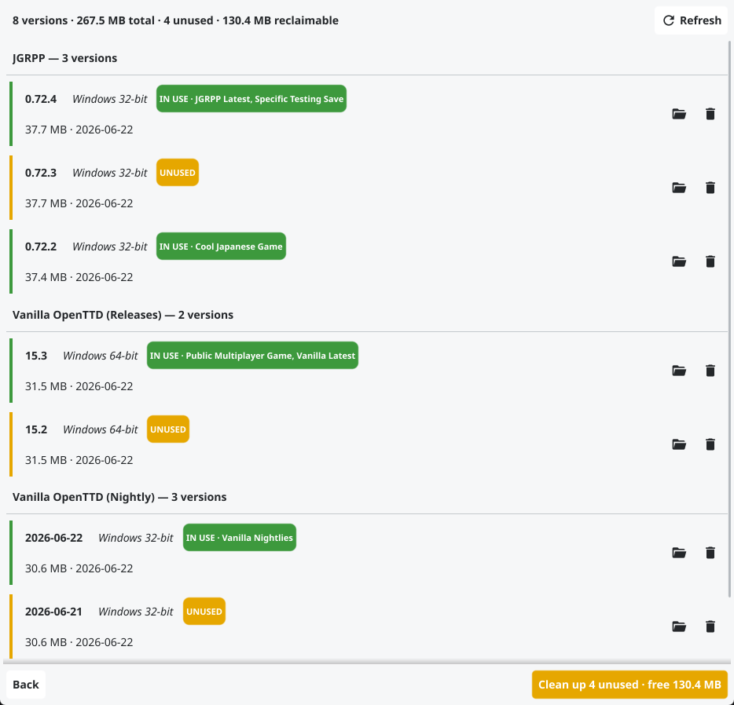

# RunTTD

[](https://github.com/tabytac/RunTTD/actions/workflows/ci.yml)
[](https://github.com/tabytac/RunTTD/releases/latest)
[](https://github.com/tabytac/RunTTD/releases)
[](LICENSE)

A small desktop launcher for OpenTTD and JGR's Patchpack (JGRPP). It downloads the version you want (vanilla stable, vanilla nightly, or JGRPP) and keeps your servers, saves, and launch options grouped into profiles.

<p align="center">
  <picture>
    <source media="(prefers-color-scheme: dark)" srcset="docs/screenshots/main-window-dark.png">
    
  </picture>
</p>

See [Known Issues](#known-issues) for compatibility details.

## Getting Started

1. Grab the build for your OS from the [Releases](https://github.com/tabytac/RunTTD/releases) page (Windows `.exe`, Linux `.tar.gz`, macOS `.zip`).
2. The app is portable: drop it in its own folder and run it. Config and profiles are written to `runttd-config.json` alongside the executable.
3. On first launch, set your **Parent Directory** (where clients are downloaded) and **Docs Base Path** (your OpenTTD `save/` and `openttd.cfg` folder), and pick a default client.
4. Create a profile, pick a client and version, and hit **Run**. The launcher downloads the client if needed and starts the game.

## Features

- **Profile system.** Set up separate profiles for different saves, servers, or JGRPP versions and switch between them.
- **Auto-download.** If the chosen client/version isn't installed locally, the launcher downloads it. Vanilla builds come from the OpenTTD CDN, JGRPP builds from GitHub releases.
- **Version pinning.** Lock a profile to a specific version like `0.72.2`, or use `latest` to always grab the newest release.
- **Status indicator.** A colored dot on each profile shows at a glance whether it's ready, has an update available, or isn't installed yet. `latest` and nightly profiles check for a newer version in the background.
- **Custom builds.** Run your own OpenTTD build by pointing a profile at its executable folder instead of a downloaded release.
- **Auto-launch on startup.** Mark one profile to launch automatically when RunTTD opens. The launcher stays open even if auto-close is on.
- **Quick launch.** Press `1`-`9` (or `0` for the 10th) to launch that profile instantly.
- **Update notifications.** Checks for new releases on startup and links you to the download.
- **Custom themes.** 8 color presets, plus a Light/Dark toggle.
- **Multiplayer quick-join.** Store the server address, passwords, and company info per profile, and the game opens straight to that server.
- **Save path loading.** Point a profile at a save folder and the launcher loads the most recent `.sav` file in it.
- **Installed-clients library.** See every downloaded version, its size on disk, and total space used; remove versions you no longer need, including a one-click cleanup of versions no profile is using.
- **Profile search.** Filter the profile list by name when you have many profiles.

## Compatibility

Tested on Windows and on Linux amd64 via WSL. macOS builds are produced in the release artifacts but the app hasn't been tested on macOS.

## Profiles

<p align="center">
  <picture>
    <source media="(prefers-color-scheme: dark)" srcset="docs/screenshots/profile-detail-dark.png">
    
  </picture>
</p>

Each profile stores:

| Field | What it does |
|---|---|
| **Name** | Display name in the list |
| **Client** | Which build to use: Vanilla OpenTTD (Releases), Vanilla OpenTTD (Nightly), JGRPP, or a Custom Executable |
| **Version** | Client version to use. `latest` or a specific tag like `0.72.2` (not used for Custom) |
| **Executable Folder** | Custom client only: folder containing your own `openttd` executable |
| **Launch Mode** | How the game starts: load a specific save file, load the newest save in a folder, or join a multiplayer server |
| **Save Path** | Relative path under your OpenTTD `save/` folder, e.g. `JGR-Saves/Japan-Game`. Loads the most recent save in that folder. Can also be an absolute path, or left blank. |
| **Server IP:Port** | Multiplayer server address, e.g. `play.example.com:3979` |
| **Server Password** | If the server requires one |
| **Company Number** | Which company slot to join |
| **Company Password** | If the company requires one |
| **Config File Override** | Optional path to an alternate `openttd.cfg` for this profile |
| **No Config Save** | Don't let OpenTTD write config changes back on exit |
| **NewGRF Scan Behavior** | Control NewGRF scanning/loading on startup (see below) |
| **Custom Arguments** | Extra command-line flags passed straight to the OpenTTD executable |

Create, edit, duplicate, and delete profiles from the main window. Everything lives in `runttd-config.json` next to the executable. The UI covers all of it, but you can hand-edit the file too.

The **Manage Installs** screen lists every downloaded version grouped by client, showing its size on disk and which profiles use it, with one-click cleanup of versions nothing uses.

<p align="center">
  <picture>
    <source media="(prefers-color-scheme: dark)" srcset="docs/screenshots/manage-installs-dark.png">
    
  </picture>
</p>

## Settings

Click **Settings** at the bottom of the profile list. The options are organized into four tabs (Files & Storage, Launching, Appearance, and Network & System):

- **Parent Directory.** Where client versions are downloaded and extracted, each in its own versioned folder (e.g. `openttd-15.3-windows-win64`, `openttd-jgrpp-0.72.4-windows-win64`).
- **Per-client subfolders.** On by default. Installs are nested under `/jgrpp`, `/vanilla`, `/vanilla-nightly`; turn it off to have every client share the parent directory directly.
- **Docs Base Path.** Your OpenTTD documents folder, where `save/` and `openttd.cfg` live.
- **Auto-close.** Close the launcher once OpenTTD starts.
- **Auto-open log panel.** Open the live log view when a launch starts, instead of the compact status band on the main screen.
- **Verbose logging.** Detailed log messages during launch.
- **Default Client.** Which client new profiles start with.
- **CDN base URLs.** Override the vanilla stable and nightly download mirrors if you want.
- **OS Type.** Defaults to Auto-detect (resolved per machine), so a shared config works on any PC. Override only to download builds for a different system.
- **GitHub API URL.** Advanced. Auto-detected; you usually shouldn't need to touch it.

## Known Issues

Stuff that's rough or untested:

- **macOS is basically untested.** Builds are produced in the release artifacts but I can't run them. Unsigned binaries also trip Gatekeeper, see Troubleshooting.
- **Linux is only tested via WSL on amd64.** Native Linux desktops, Wayland quirks, and other architectures might work, might not. I haven't tried.
- **On Linux, only the generic build is used.** RunTTD downloads `linux-generic-amd64`, not distro-specific (Debian/Ubuntu) or dedicated-server packages. You can still point a Custom Executable profile at another build you installed yourself, but dedicated-server builds are headless and won't run as a playable client.
- **Error handling is best-effort.** If a download or extraction fails it cleans up the partial archive, logs what went wrong (with verbose logging on), and stops rather than retrying. It does try several archive formats and URLs first.
- **Not heavily tested across odd config combinations.** It works for the setups I use. Unusual path, version, or profile combinations may surface bugs.
- **No invite-code join.** The Server IP:Port field only takes a plain `host:port`. OpenTTD's invite codes `+XXXXXXXX` won't work here, so for those you'll need to join from the in-game server browser instead.
- **Toggling per-client subfolders does not migrate existing installs.** Switching it on or off does not move already-downloaded folders, so the launcher won't find them in the new location and will re-download on next launch. The old folders are left where they are. Manually moving or deleting them is recommended.

## Troubleshooting

- **Launcher exits immediately.** Enable `logToFile` manually in `runttd-config.json` and check `log.txt` in the same folder.
- **"Executable not found".** Make sure your Parent Directory path is correct and contains extracted client folders like `openttd-15.3-...` or `openttd-jgrpp-...`.
- **Save not loading.** Check that the Save Path in your profile matches an actual folder under your OpenTTD `save/` directory. The launcher picks the newest `.sav` file in that folder.
- **Download fails.** With verbose logging on, the log shows which URLs it tried. Usually a connectivity or mirror issue.
- **macOS "app is damaged".** That's Gatekeeper blocking an unsigned binary. Right-click the file, choose Open, then Open again to allow it.

## Building from Source

Requires Go 1.26+. Linux builds also need `libgl1-mesa-dev` and `xorg-dev`.

```bash
# Windows
go build -ldflags "-H=windowsgui" -o dist/RunTTD.exe ./cmd/runttd

# Linux / macOS
go build -o dist/RunTTD ./cmd/runttd
```

## License

This project is licensed under the [Creative Commons Attribution-NonCommercial-ShareAlike 4.0 International License](LICENSE) (CC BY-NC-SA 4.0).
